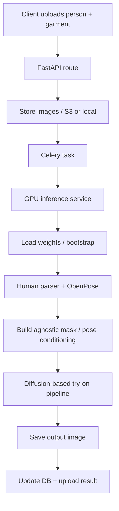

# Virtual Try-On Project Analysis Report

## Scope and evidence reviewed

This report is based on the repository implementation in:

- [api/app/routes/tryon.py](api/app/routes/tryon.py)
- [api/app/workers/tasks.py](api/app/workers/tasks.py)
- [api/app/services/gpu_inference_service.py](api/app/services/gpu_inference_service.py)
- [api/app/services/model_bootstrap.py](api/app/services/model_bootstrap.py)
- [ml/scripts/gpu_inference.py](ml/scripts/gpu_inference.py)
- [ml/src/models/pipeline.py](ml/src/models/pipeline.py)
- [ml/src/models/warping.py](ml/src/models/warping.py)
- [ml/src/models/unet.py](ml/src/models/unet.py)
- [ml/src/data/preprocess.py](ml/src/data/preprocess.py)
- [ml/src/inference/infer.py](ml/src/inference/infer.py)
- [ml/src/training/train.py](ml/src/training/train.py)
- [api/requirements-gpu.txt](api/requirements-gpu.txt)
- [api/Dockerfile.gpu](api/Dockerfile.gpu)
- [api/docker-compose.gpu.yml](api/docker-compose.gpu.yml)

---

## 1. Current architecture

The repository is a hybrid system with two different VTON stacks:

1. A production-style runtime path that uses an IDM-VTON-style diffusion pipeline for image generation.
2. A lightweight custom training/inference path under [ml/src](ml/src) that is more of a research/demo baseline than a production-quality model.

### Runtime execution flow

1. A client uploads a person image and garment image through [api/app/routes/tryon.py](api/app/routes/tryon.py).
2. The request is stored in local storage or S3 via [api/app/services/storage.py](api/app/services/storage.py).
3. The FastAPI route dispatches a Celery job through [api/app/workers/tasks.py](api/app/workers/tasks.py).
4. The worker calls [api/app/services/gpu_inference_service.py](api/app/services/gpu_inference_service.py), which lazily initializes a GPU inference engine.
5. The engine is implemented in [ml/scripts/gpu_inference.py](ml/scripts/gpu_inference.py).
6. That script runs:
   - a human parser,
   - OpenPose,
   - a diffusion-based try-on pipeline,
   - and writes the final image.

### Training flow

1. The API worker saves generated pairs to storage and records a quality score.
2. The training pipeline in [ml/src/training/train.py](ml/src/training/train.py) reads those pairs from storage.
3. The model defined in [ml/src/models/pipeline.py](ml/src/models/pipeline.py) trains a small ResNet-based encoder + simple warping module + UNet generator.

### Important architectural finding

The deployed runtime is not the same as the custom training model. The production path uses an external diffusion-based pipeline, while the custom training stack under [ml/src](ml/src) is a separate, simpler model. This is a design mismatch and one reason the system is hard to reason about and hard to improve consistently.

---

## 2. AI/ML models being used

### A. Production/runtime models

| Component | Where it is used | Role in the pipeline |
|---|---|---|
| SCHP human parser | [ml/scripts/gpu_inference.py](ml/scripts/gpu_inference.py) | Produces a human parsing result used to build an agnostic person representation and mask. |
| OpenPose | [ml/scripts/gpu_inference.py](ml/scripts/gpu_inference.py) | Extracts 2D body keypoints for pose conditioning. |
| StableDiffusionXLInpaintPipeline | [ml/scripts/gpu_inference.py](ml/scripts/gpu_inference.py) | The main try-on generator. |
| UNet2DConditionModel (try-on UNet) | [ml/scripts/gpu_inference.py](ml/scripts/gpu_inference.py) | Diffusion denoising backbone for the try-on result. |
| UNet2DConditionModel (garment encoder UNet) | [ml/scripts/gpu_inference.py](ml/scripts/gpu_inference.py) | Encodes garment information into the diffusion conditioning branch. |
| CLIPVisionModelWithProjection | [ml/scripts/gpu_inference.py](ml/scripts/gpu_inference.py) | Encodes the garment image for the model’s image-conditioned pathway. |
| AutoencoderKL | [ml/scripts/gpu_inference.py](ml/scripts/gpu_inference.py) | Latent image encoder/decoder used by the diffusion model. |

### B. Custom training stack in this repository

| Component | Where it is used | Role |
|---|---|---|
| GarmentEncoder | [ml/src/models/garment_encoder.py](ml/src/models/garment_encoder.py) | ResNet50-based feature extractor for garment appearance. |
| PersonEncoder | [ml/src/models/pipeline.py](ml/src/models/pipeline.py) | ResNet50-based feature extractor for person appearance. |
| CorrelationNet | [ml/src/models/warping.py](ml/src/models/warping.py) | Predicts a warp parameter tensor for garment deformation. |
| UNet | [ml/src/models/unet.py](ml/src/models/unet.py) | Generator that fuses person, warped garment, and mask. |
| VTONPipeline | [ml/src/models/pipeline.py](ml/src/models/pipeline.py) | End-to-end lightweight try-on model used by training and local inference. |

### C. Absent or placeholder components

| Component | Status | Evidence |
|---|---|---|
| DensePose | Placeholder only | [ml/src/data/preprocess.py](ml/src/data/preprocess.py) creates a dummy image instead of real DensePose features. |
| Face preservation | Not implemented | No dedicated face ID model or face encoder is present in the runtime pipeline. |
| Real garment warping module | Not fully implemented | [ml/src/models/warping.py](ml/src/models/warping.py) uses an affine approximation rather than a full TPS/flow-based warp. |

---

## 3. Image flow from input to output

### Input path

1. The user uploads a person image and a garment image via [api/app/routes/tryon.py](api/app/routes/tryon.py).
2. The route validates the file type and size, then stores the files.
3. The job is submitted to Celery in [api/app/workers/tasks.py](api/app/workers/tasks.py).

### Inference path

1. The Celery worker resolves the input images locally through [api/app/workers/tasks.py](api/app/workers/tasks.py).
2. [api/app/services/gpu_inference_service.py](api/app/services/gpu_inference_service.py) ensures the GPU engine is initialized and the weights are available.
3. [ml/scripts/gpu_inference.py](ml/scripts/gpu_inference.py) loads:
   - the human parser,
   - OpenPose,
   - and the diffusion pipeline.
4. The script creates an agnostic representation of the person using the parser and pose keypoints.
5. The garment image is resized and conditioned onto the diffusion model.
6. The model generates the final image and writes it to disk.

### Output path

1. The result is uploaded back to storage from [api/app/workers/tasks.py](api/app/workers/tasks.py).
2. The DB record is updated with the output URL and a quality score.
3. The result may be saved as a training pair if the SSIM threshold is met.

---

## 4. Why the virtual try-on output quality is likely poor

The repository shows several concrete reasons:

### 4.1 The preprocessing stack is weak

The custom preprocessing code in [ml/src/data/preprocess.py](ml/src/data/preprocess.py) is not a real VTON preprocessing pipeline. It:

- resizes and pads images,
- creates a dummy DensePose image,
- and produces an agnostic mask from a hard-coded torso label assumption.

That is not enough for robust clothing transfer, especially for non-standard poses or complex garments.

### 4.2 The custom warping module is simplistic

In [ml/src/models/warping.py](ml/src/models/warping.py), the warp is reduced to an affine approximation. That is far weaker than modern TPS/flow-based warping used in state-of-the-art VTON systems.

### 4.3 The custom training model is a baseline, not a production VTON model

The model in [ml/src/models/pipeline.py](ml/src/models/pipeline.py) uses:

- a ResNet50 backbone,
- a small MLP warp head,
- and a UNet generator.

This is a reasonable toy architecture, but it is much weaker than current diffusion-based VTON models such as IDM-VTON, CatVTON, OOTDiffusion, or StableVITON.

### 4.4 There is no dedicated face-preservation model

The runtime path does not include face ID preservation, so identity consistency can degrade significantly when the person pose or garment changes.

### 4.5 The training data is self-reinforcing and weak

The training pairs are saved based on SSIM in [api/app/workers/tasks.py](api/app/workers/tasks.py). SSIM is a weak proxy for VTON quality because it rewards similarity to the original image rather than true garment transfer quality. This can cause the model to learn poor habits and overfit to simple cases.

---

## 5. Bottlenecks by component

### Human parsing

Bottleneck:
- Parsing quality depends on the external parser and the mask-building logic in [ml/scripts/gpu_inference.py](ml/scripts/gpu_inference.py).
- The current logic is not strongly robust to occlusion, accessories, or unusual poses.

Impact:
- The generated agnostic person representation can be inaccurate.
- The final try-on result may show bad arm, torso, or clothing boundary artifacts.

### Pose estimation

Bottleneck:
- Pose estimation is handled by OpenPose in [ml/scripts/gpu_inference.py](ml/scripts/gpu_inference.py).
- The code uses a simple pose rendering and conditioning path, but there is no explicit pose refinement or 3D-aware correction.

Impact:
- Side-view or unusual poses can produce incorrect garment placement.

### DensePose

Bottleneck:
- DensePose is effectively absent in the custom pipeline. The function in [ml/src/data/preprocess.py](ml/src/data/preprocess.py) is only a placeholder.

Impact:
- The model cannot benefit from dense body-surface alignment, which is important for accurate garment placement and fit.

### Garment warping

Bottleneck:
- The custom warping module in [ml/src/models/warping.py](ml/src/models/warping.py) is an affine approximation, not a full geometry-aware warp.

Impact:
- Garment shape distortion is common, especially around sleeves, collars, and the torso.

### Diffusion model quality

Bottleneck:
- The current runtime uses a diffusion backbone, but the prompt and conditioning are generic in [ml/scripts/gpu_inference.py](ml/scripts/gpu_inference.py).
- The model is not explicitly tuned for VTON-specific garment fidelity and identity preservation.

Impact:
- Texture and anatomy artifacts are common.
- Output quality is inconsistent across garments and poses.

### Face preservation

Bottleneck:
- No dedicated face ID module exists.

Impact:
- The face may change or look distorted when garment or pose changes.

### Resolution issues

Bottleneck:
- The custom training path uses 512px images in [ml/src/inference/infer.py](ml/src/inference/infer.py) and [ml/src/models/pipeline.py](ml/src/models/pipeline.py).
- The production runtime uses 768x1024 in [ml/scripts/gpu_inference.py](ml/scripts/gpu_inference.py), which is better but still not enough for fine garment textures.

Impact:
- Fine details such as logos, collars, prints, and facial identity are not preserved well.

### Training data limitations

Bottleneck:
- The training data is collected from API-generated outputs and filtered only by SSIM in [api/app/workers/tasks.py](api/app/workers/tasks.py).
- The custom training pipeline in [ml/src/data/dataset.py](ml/src/data/dataset.py) also uses an overly simplistic agnostic mask.

Impact:
- The model learns from noisy, weakly curated data and will not generalize strongly.

---

## 6. Comparison with modern virtual try-on models

| Model | How it compares to this repo | Verdict |
|---|---|---|
| IDM-VTON | Already closest to the current runtime style and already referenced in the deployment code. Strong garment conditioning, but still heavy and requires substantial GPU memory. | Best immediate upgrade path. |
| CatVTON | Stronger garment alignment and more targeted garment warping than the current custom stack. Better fit quality than a simple baseline. | Good candidate if the goal is better garment shape fidelity. |
| OOTDiffusion | Strong zero-shot try-on quality and relatively simpler deployment than some heavier pipelines. | Good option for a simpler integration path. |
| StableVITON | Better diffusion-based garment fidelity and strong conditioning with a mature open-source ecosystem. | Strong quality choice, but may require more engineering than IDM-VTON. |

### Practical conclusion

The current repository is not a state-of-the-art VTON system. It is a functional prototype that combines a custom baseline model with a heavier diffusion runtime. The best practical next step is to stop relying on the custom baseline in [ml/src](ml/src) for production and upgrade the runtime path to a stronger pretrained, open-source VTON model.

---

## 7. Recommendation

### Should the current model be improved?

Yes, but only partially. The current production path should be improved, while the custom training stack should be retired from production use.

### Should a component be replaced?

Yes. The most worthwhile component replacement is:

- replace the weak custom training stack in [ml/src/models/pipeline.py](ml/src/models/pipeline.py), [ml/src/models/warping.py](ml/src/models/warping.py), and [ml/src/data/preprocess.py](ml/src/data/preprocess.py);
- keep the API/Celery/deployment architecture intact;
- swap in a stronger pretrained VTON model.

### Should the entire VTON model be replaced?

Not necessarily. The API, storage, queueing, and container architecture are already usable. The main weakness is the model stack and preprocessing. Replacing the model stack while preserving the service architecture is the best balance between effort and quality.

---

## 8. Best free pretrained model with minimum code changes

### Recommendation: IDM-VTON

Why this is the best fit for this repository:

- The repository already contains an IDM-VTON-oriented runtime path in [ml/scripts/gpu_inference.py](ml/scripts/gpu_inference.py).
- The bootstrap and model-loading flow already exists in [api/app/services/model_bootstrap.py](api/app/services/model_bootstrap.py).
- The deployment stack in [api/docker-compose.gpu.yml](api/docker-compose.gpu.yml) is already set up for GPU-backed inference.

This means the integration cost is lower than introducing a completely different architecture from scratch.

### Alternative

If the goal is a slightly simpler deployment path, OOTDiffusion is also reasonable. It may require less custom glue than IDM-VTON, but it is not as already integrated into the current repo.

---

## 9. Migration plan

### Files to modify

1. [ml/scripts/gpu_inference.py](ml/scripts/gpu_inference.py)
   - Replace or wrap the current model-loading logic to use the new pretrained VTON model.

2. [ml/src/models/pipeline.py](ml/src/models/pipeline.py)
   - Deprecate or replace the current lightweight custom pipeline for production inference.

3. [ml/src/models/warping.py](ml/src/models/warping.py)
   - Remove or stop using the affine-only warp placeholder.

4. [ml/src/data/preprocess.py](ml/src/data/preprocess.py)
   - Replace the placeholder DensePose and agnostic mask logic with a real preprocessing path.

5. [api/app/services/model_bootstrap.py](api/app/services/model_bootstrap.py)
   - Update the weight bootstrap to match the new model archive.

6. [api/requirements-gpu.txt](api/requirements-gpu.txt)
   - Add the new model dependencies.

7. [api/Dockerfile.gpu](api/Dockerfile.gpu)
   - Ensure the new runtime dependencies are installed in the GPU image.

8. [api/docker-compose.gpu.yml](api/docker-compose.gpu.yml)
   - Adjust GPU memory settings and environment variables if required.

### New dependencies to consider

- For stronger conditioning and face preservation:
  - insightface
  - onnxruntime-gpu
- For improved preprocessing and body alignment:
  - detectron2
  - segment-anything
  - scipy
  - albumentations
- Existing diffusion stack is already partly covered in [api/requirements-gpu.txt](api/requirements-gpu.txt), but the final model choice may require additional version pinning and compatibility work.

### GPU requirements

- For an SDXL-based VTON model such as IDM-VTON or a similar diffusion-based system:
  - recommended: 24 GB VRAM
  - acceptable minimum for lower resolution: 16 GB VRAM
- For a lighter model or lower resolution mode:
  - 12 GB VRAM may work, but quality will be lower.

### Inference performance impact

- First-time model load will be slower because the weights and runtime are initialized once.
- Per-image inference will likely increase compared to the current lightweight baseline, especially at higher resolution.
- Expect a trade-off: better garment fit and visual quality at the cost of latency.

### Estimated implementation effort

- Minimal-change upgrade to a better pretrained model: about 1–2 weeks of engineering for integration and testing.
- Robust production-quality version with real parsing, DensePose, and face preservation: about 3–6 weeks.

### Expected quality improvement

- Moderate to large improvement in garment fit and realism.
- Better preservation of clothing structure and pose consistency.
- Better identity retention if face-preserving components are added.

---

## 10. Final conclusion

The repository already has the right service skeleton for a production VTON API, but the actual model quality is limited by a combination of:

- a weak custom training stack,
- placeholder preprocessing,
- a simplistic warp module,
- and lack of face preservation.

The best next step is not to rebuild the whole service. The best step is to keep the API/Celery deployment architecture and replace the weak model/preprocessing stack with a stronger pretrained VTON model, preferably IDM-VTON as the lowest-friction option.
